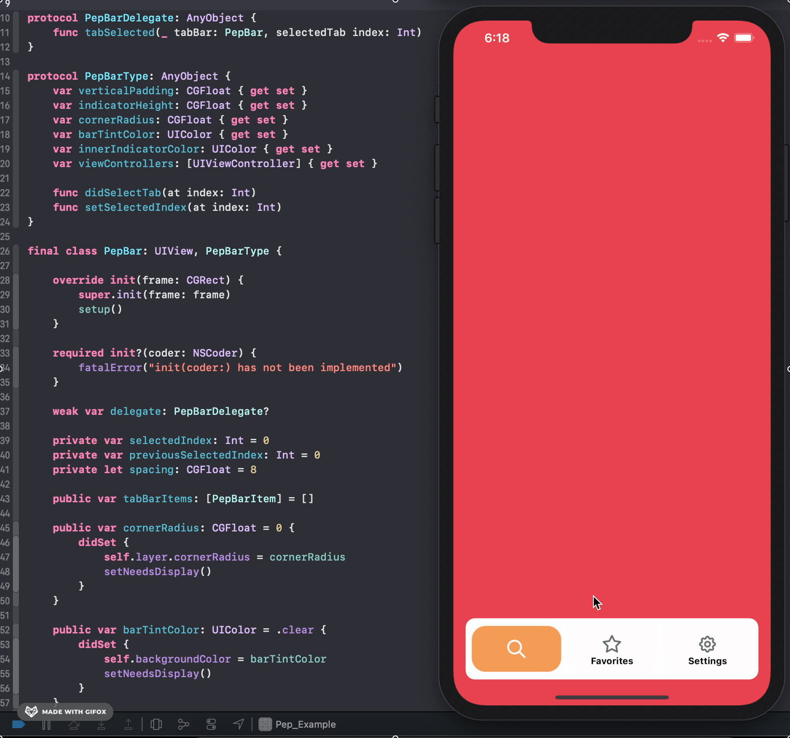

# Pep a.k.a PepBar
> Pep is a lightweight, highly customizable TabBar-like approach.

[](https://swift.org)
[](https://opensource.org/licenses/MIT)
[](https://img.shields.io/cocoapods/v/LFAlertController.svg)  
[](http://cocoapods.org/pods/LFAlertController)
[](http://makeapullrequest.com)

One to two paragraph statement about your product and what it does.



## Requirements

- iOS 11.0+
- Xcode 10.0+

## Installation

#### CocoaPods
You can use [CocoaPods](http://cocoapods.org/) to install `Pep` by adding it to your `Podfile`:

```ruby
pod 'Pep'
```
Then, run the following command in command-line:

```bash
$ pod install
```

To get the full benefits import `Pep` wherever you import UIKit

``` swift
import UIKit
import Pep
```

#### Manually
1. Download and drop ```Sources``` file  in your project.  
2. Congratulations!  

## Usage example

1. Create a class that inherits from ```PepTabBarController```
```swift
import EZSwiftExtensions
final class TabBarController: PepTabBarController {}
```
2. In this class, initialize view controllers that you want to present in bar.
```swift
let homeViewController = HomeViewController()
let favoritesViewController = FavoritesViewController()
let settingsViewController = SettingsViewController()
```
3. Assign UITabBarItem to view controllers with title, image and selected image properties.
```swift
let image = UIImage(named: "x").withRenderingMode(.alwaysOriginal)
let selectedImage = UIImage(named: "y").withRenderingMode(.alwaysOriginal)
homeViewController.tabBarItem = UITabBarItem(title: title, image: image, selectedImage: selectedImage)
}
```
4. In ```viewDidLoad``` assign these view controllers to `self.viewControllers`
```swift
override func viewDidLoad() {
    super.viewDidLoad()

    self.viewControllers = [
        homeViewController, favoritesViewController, settingsViewController
    ]
}
```
5. Voila! You are ready to go.

## Contribute

We would love you for the contribution to **Pep**.


## Meta

befy– [@alpertab](https://twitter.com/alpertab) – alper@tabak.com

Pep is available under the MIT license. See the LICENSE file for more info.
